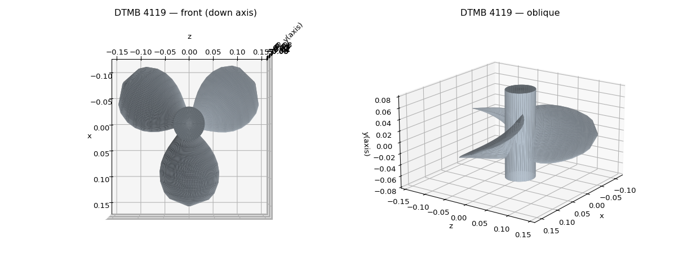
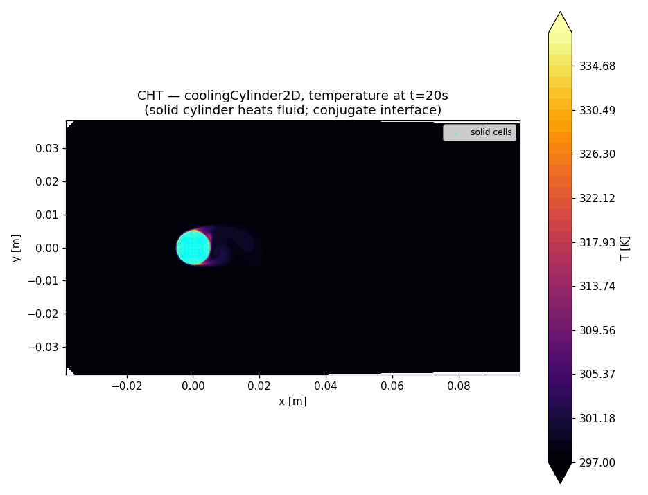
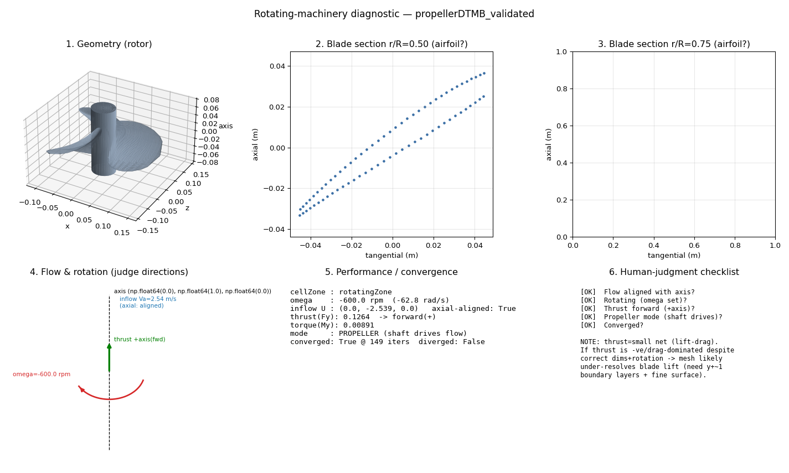

# myOpenFoamAgent

**An LLM agent that operates OpenFOAM end-to-end — meshing, solving, rotating machinery, conjugate heat transfer — with a self-evolving tool framework, a regression-canary safety gate, and results validated against published experiments.**

Claude drives OpenFOAM 12 through 46 typed tools: it proposes each step (case setup → meshing → solver configuration → run → post-processing → report), a human approves gated actions, and every run's settings and results are persisted to a recipe database that future runs reuse.

| | |
|---|---|
|  |  |
| *CAD-free propeller geometry, generated from published offset tables* | *Conjugate heat transfer — solid cylinder heating the surrounding flow* |


*Auto-generated rotor diagnostic — geometry, blade sections, flow/rotation/thrust directions, convergence and a human-judgment checklist.*

## Validation — physics as the test oracle

The agent reproduces canonical validation cases end-to-end, without human CFD setup:

| Case | What the agent did | Reference |
|---|---|---|
| DTMB 4119 marine propeller (MRF) | CAD-free geometry from offset tables → cellZone mesh → MRF → converged open-water point; Kt = 0.1476 vs 0.146 measured, Kq high as expected from simplified blade sections | Jessup (1989) experiment |
| Wageningen B4-70 propeller | parametric family generation (Z, AE/A0, P/D); open-water curve consistent with the polynomial | B-series polynomials |
| motorBike external aero | full snappyHexMesh + RANS to converged drag, Cd = 0.415 vs ≈ 0.40 | OpenFOAM reference case |
| Lid-driven cavity sweep | Re = 100 → 10,000 | classic benchmark series |
| Conjugate heat transfer | 4 multiRegion cases (2D cylinder, sphere, circuit board, heated duct) | OpenFOAM 12 tutorials |

A note on agreement: close numerical match in RANS-level CFD always contains some fortuitous error cancellation, so none of this is an accuracy claim. These cases do two other jobs: they verify that the agent gets the *engineering* right — geometry, meshing, MRF configuration, convergence — with no human in the setup loop, and they are the physics oracle for the self-modification canary: every proposed change to the system must still reproduce them.

The propeller work also surfaced an honest negative result: an off-design demo operating point produced η₀ > 1 (non-physical), which the workflow flagged instead of hiding — the method was sound, the operating point was not. That distinction is the job.

## What it can do

- **Meshing, three ways**: gmsh with a validator-gated repair loop (quality knobs chosen from a measured study), netgen prism boundary layers for clean geometry, full snappyHexMesh (castellate + snap + addLayers, parallel) for arbitrary dirty STLs.
- **CAD-free geometry**: downloads shapes from the internet (motorBike, UIUC airfoils, arbitrary URLs) or *generates* them — a parametric propeller generator lofts DTMB 4119 and the whole Wageningen B-series family from offset tables.
- **Physics scaffolding**: turbulence model selection (kOmegaSST / SpalartAllmaras / kEpsilon / laminar) with auto-generated fields, BCs and wall functions; MRF rotating machinery; multiRegion CHT.
- **Runs like an engineer**: convergence-driven iteration (residualControl with an iteration *cap*, not a fixed count), background solver jobs with status/stop control, MPI parallelism, force/thrust/torque extraction, six-panel rotor diagnostic reports with a human-judgment checklist.
- **Learns across runs**: an SQLite registry accumulates per-stage success recipes (mesh → boundary layers → RANS → solve) and `find_similar_runs` feeds them back to the LLM.
- **Long sessions**: prompt caching, transcript trim/compaction, session resume.

## Self-evolution, treated as a security problem

The agent can extend its own toolset — which is exactly the kind of capability that should make you nervous, so it is built nervous:

- **Three trust tiers.** Hot-reloadable plugins (`tools_plugins/`) can be added autonomously; ordinary modules require staged validation and a restart; the engine, trusted root, config, LLM loop, and binary-execution gateway are `PROTECTED` — the self-evolution engine refuses to write them, so it can never quietly disable its own safety gate.
- **A canary is the oracle.** Every proposed change runs a regression suite covering syntax, tool-schema integrity, security invariants (gated-tool set, binary allowlist, approval gate, sandbox presence) and physics ground truth (the DTMB/B-series numbers must still come out right). Fail → the change is discarded.
- **Sandboxed execution, fail-closed.** Plugin handlers run in a bwrap-confined subprocess — no network, minimal binds, secrets invisible. If no real sandbox is available, plugin execution and autonomy are refused rather than silently degraded.
- **Adversarially red-teamed.** Four rounds of adversarial review against the self-modification system drove confirmed critical findings from 16 → 0. The honest lesson: never declare a self-modifying system safe after one fix; re-attack it.

## Hard-won lessons (the debugging stories)

- **`MRFnoSlip`, not `noSlip`.** A rotating wall left as plain `noSlip` is a stationary wall in the absolute frame — the blades never spun, and thrust was pure drag. Found via a swirl probe after eight wasted solves. If rotating-machinery thrust looks wrong, suspect the MRF wall BC and rotation direction before the geometry.
- **"Converged" must be earned.** Solver timeouts, kills, and Courant blow-ups were masquerading as convergence; the runner now cross-checks OpenFOAM's explicit convergence message against clean-exit and divergence detection before anything is recorded.
- **Sandboxes that fail open are traps.** Isolation that silently degrades to "no isolation, still labeled safe" is worse than none. Everything here fails closed.
- **Quantitative rotor CFD needs human eyes.** Thrust is a small net of large lift/drag components and flips sign easily — hence a visual diagnostic report (geometry, sections, axis alignment, rotation/thrust arrows) built for human judgment, not just numbers.

## Built with Claude

This system was built in collaboration with Claude (and it is Claude that drives it at runtime). The architecture, safety design, physics judgment, and validation methodology are mine; a large share of the code was written by Claude under my direction and review. The red-team rounds, the canary suite, and the literature validation exist precisely because AI-written code — like human-written code — is trusted only after it is attacked and measured.

## Quickstart

Requires WSL2/Ubuntu (or Linux), OpenFOAM 12 (Foundation), Python 3.10+, and an Anthropic API key.

```bash
python3 -m venv ~/of_agent_venv && ~/of_agent_venv/bin/pip install -r requirements.txt
export ANTHROPIC_API_KEY=sk-ant-...

python bootstrap.py --canary     # health check: 13 checks must pass (no API key needed)
python bootstrap.py              # interactive agent (supervised, auto-venv)
python agent.py --task "set up the cavity tutorial, run it briefly, build a report" --yes
```

Key environment variables: `OF_AGENT_MODEL`, `OF_AGENT_RUNS` (case data root), `OF_AGENT_WEB=1` (opt-in web search/fetch), `OPENFOAM_BASHRC`. See `SETUP.md`.

## Roadmap

- **Autonomous evaluation layer** — a task suite with physics-anchored graders (analytic solutions, tabulated experiments) to score agents end-to-end, including the experiment this project exists to run: *the same model, bare-shell vs. inside this 39-tool environment* — measuring how much environment design changes agent capability.
- Canary split into security / health / domain tiers; parallel decompose sizing; pre-solve physics preflight (swirl, thrust sign, Re, BCs) to kill 25-minute mistakes in 25 seconds.
- PyFluent backend — the same tool-use structure driving a commercial solver.

## Author

**Jongwook Joo, Ph.D.** — 18+ years in turbomachinery aerodynamics and CFD: Stanford Ph.D. (turbulence simulation), Staff Research Scientist at United Technologies Research Center (NASA/Sikorsky programs; 2017 AHS Alfred Gessow Best Paper Award), Principal Engineer at Samsung Electronics. This is a personal project, built on personal time and hardware.

## License

GPL-3.0 — the project imports GPL-licensed components (gmsh Python API, pymeshfix). OpenFOAM itself runs as external binaries and is not distributed here.
