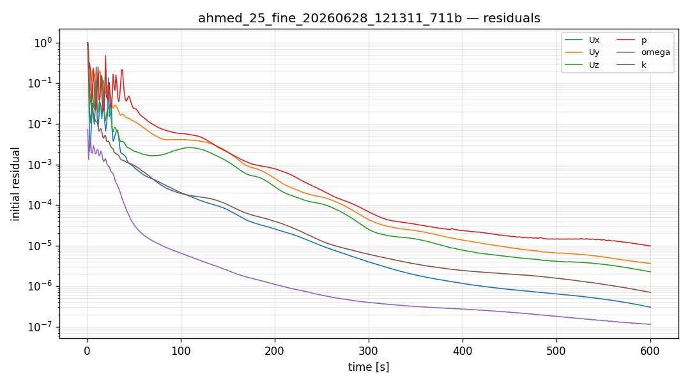
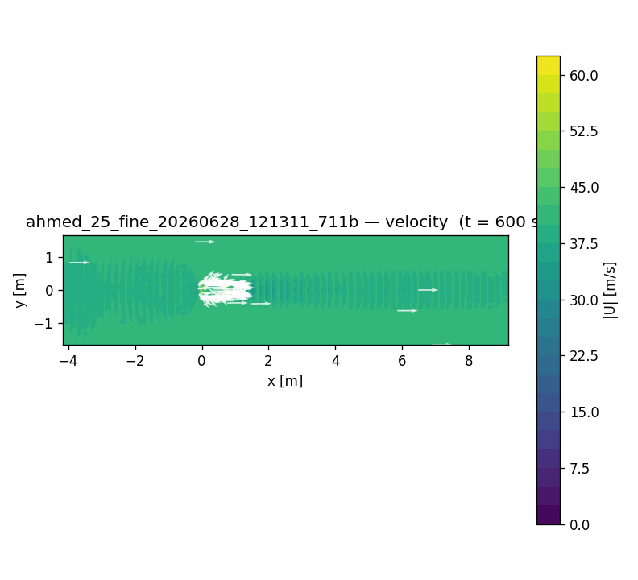

# CFD run report — `ahmed_25_fine_20260628_121311_711b`

## 설정 (settings)

| 항목 | 값 |
|---|---|
| case_kind | ahmed_25_fine |
| solver | incompressibleFluid |
| turbulence | kOmegaSST |
| viscosity nu | [0 2 -1 0 0 0 0] 1.5e-05 |
| endTime | 600 |
| geometry | None |

## 격자 품질 (checkMesh)

| 지표 | 값 |
|---|---|
| cells | 678296 |
| max non-orthogonality | 64.9317 |
| max skewness | 2.70654 |
| Mesh OK | True |

## 실행 결과 (run)

| 항목 | 값 |
|---|---|
| reached time | 600.0 |
| max Courant | None |
| diverged | False |
| converged | 1 |
| wall time [s] | 183.8 |

## 수렴 (residuals)

## 속도장 (velocity)

