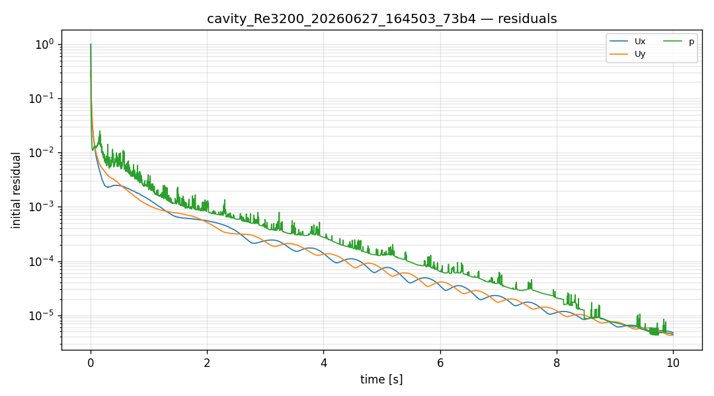
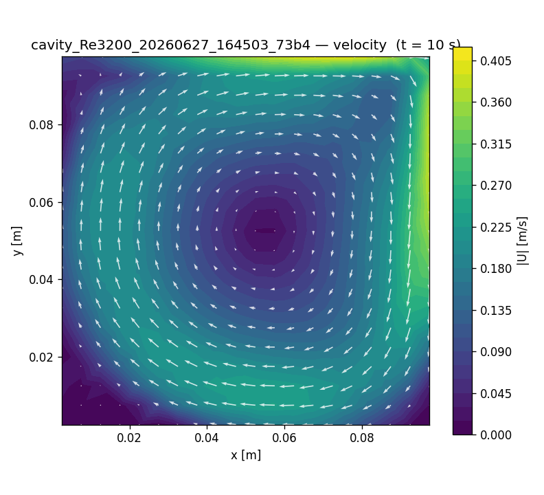

# CFD run report — `cavity_Re3200_20260627_164503_73b4`

## 설정 (settings)

| 항목 | 값 |
|---|---|
| case_kind | cavity_Re3200 |
| solver | incompressibleFluid |
| turbulence | kEpsilon |
| viscosity nu | 3.125e-05 [m^2/s] |
| endTime | 10 |
| geometry | tutorial:incompressibleFluid/cavity |

## 격자 품질 (checkMesh)

| 지표 | 값 |
|---|---|
| cells | None |
| max non-orthogonality | None |
| max skewness | None |
| Mesh OK | None |

## 실행 결과 (run)

| 항목 | 값 |
|---|---|
| reached time | 10.0 |
| max Courant | 0.16259 |
| diverged | False |
| converged | 1 |
| wall time [s] | 4.4 |

## 수렴 (residuals)

## 속도장 (velocity)

