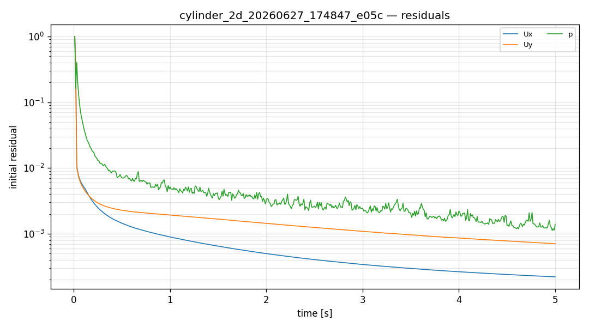
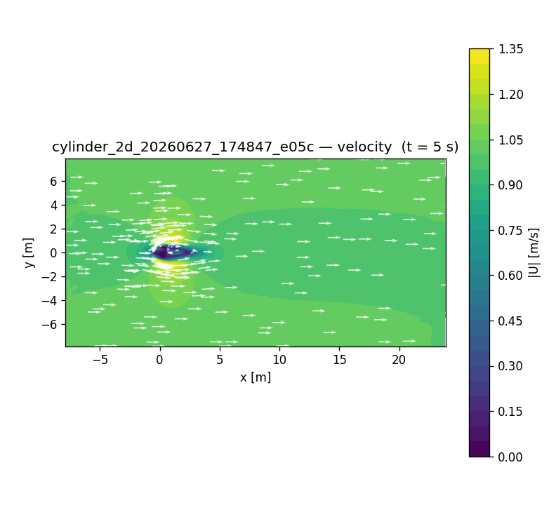

# CFD run report — `cylinder_2d_20260627_174847_e05c`

## 설정 (settings)

| 항목 | 값 |
|---|---|
| case_kind | cylinder_2d |
| solver | incompressibleFluid |
| turbulence | laminar |
| viscosity nu | 0.01 [m^2/s] |
| endTime | 5 |
| geometry | gmsh:cylinder_2d |

## 격자 품질 (checkMesh)

| 지표 | 값 |
|---|---|
| cells | 8387 |
| max non-orthogonality | 32.7157 |
| max skewness | 0.653731 |
| Mesh OK | True |

## 실행 결과 (run)

| 항목 | 값 |
|---|---|
| reached time | 5.0 |
| max Courant | 0.559137 |
| diverged | False |
| converged | 1 |
| wall time [s] | 4.0 |

## 수렴 (residuals)

## 속도장 (velocity)

