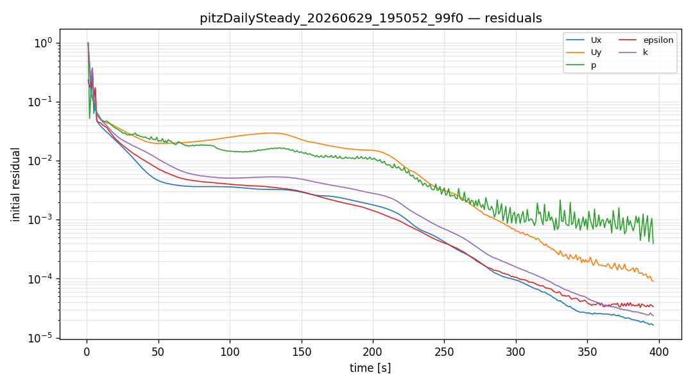
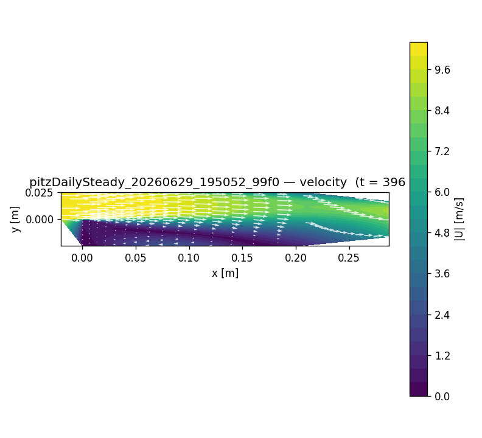

# CFD run report — `pitzDailySteady_20260629_195052_99f0`

## 설정 (settings)

| 항목 | 값 |
|---|---|
| case_kind | pitzDailySteady |
| solver | incompressibleFluid |
| turbulence | kEpsilon |
| viscosity nu | 1e-05 |
| endTime | 2000 |
| geometry | tutorial:incompressibleFluid/pitzDailySteady |

## 격자 품질 (checkMesh)

| 지표 | 값 |
|---|---|
| cells | 12225 |
| max non-orthogonality | 5.95045 |
| max skewness | 0.260575 |
| Mesh OK | True |

## 실행 결과 (run)

| 항목 | 값 |
|---|---|
| reached time | 396.0 |
| max Courant | None |
| diverged | False |
| converged | 1 |
| wall time [s] | 6.7 |

## 수렴 (residuals)

## 속도장 (velocity)

