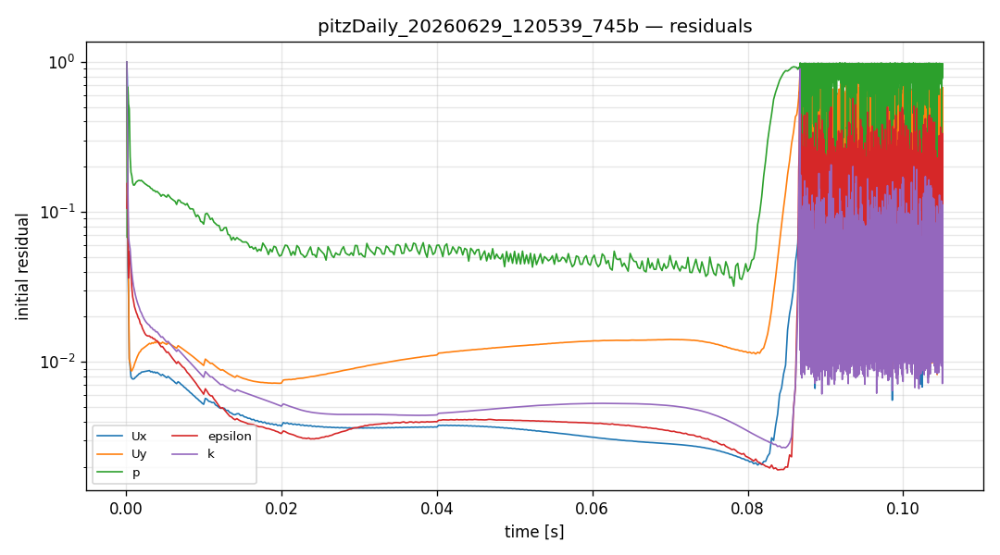
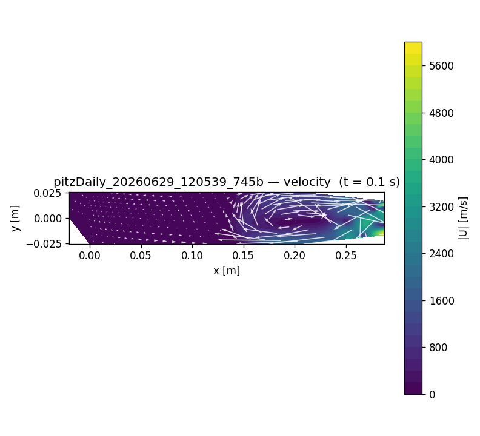

# CFD run report — `pitzDaily_20260629_120539_745b`

## 설정 (settings)

| 항목 | 값 |
|---|---|
| case_kind | pitzDaily |
| solver | incompressibleFluid |
| turbulence | kEpsilon |
| viscosity nu | [0 2 -1 0 0 0 0] 1e-05 |
| endTime | 0.1 |
| geometry | tutorial:incompressibleFluid/pitzDaily |

## 격자 품질 (checkMesh)

| 지표 | 값 |
|---|---|
| cells | 21580 |
| max non-orthogonality | 5.93112 |
| max skewness | 0.259722 |
| Mesh OK | True |

## 실행 결과 (run)

| 항목 | 값 |
|---|---|
| reached time | 0.1050666 |
| max Courant | 25.153 |
| diverged | False |
| converged | 0 |
| wall time [s] | 1800.1 |

## 수렴 (residuals)

## 속도장 (velocity)

