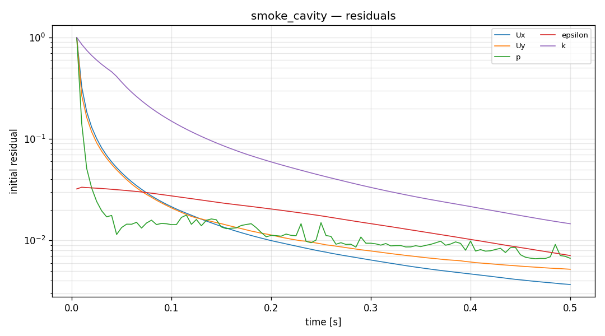
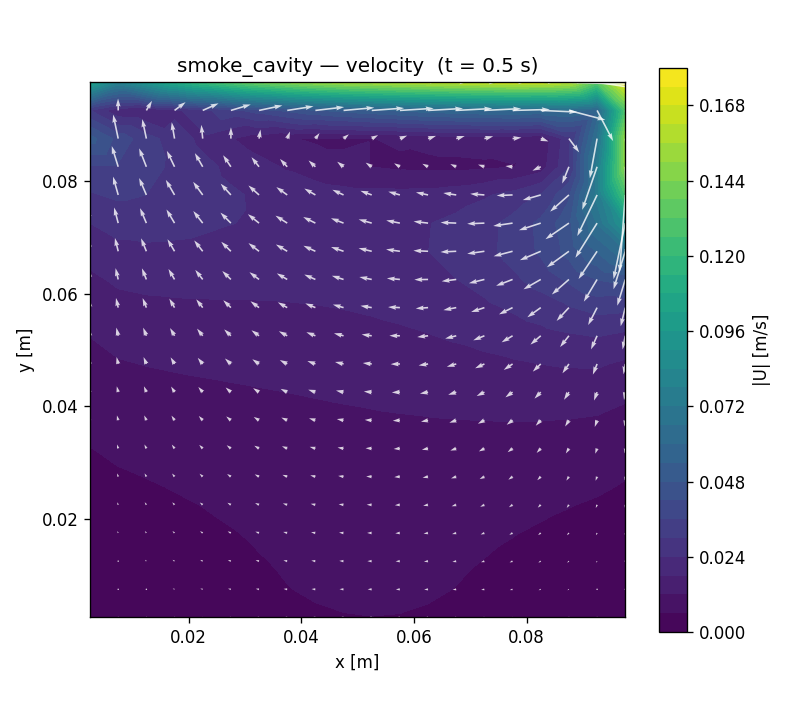

# CFD run report — `smoke_cavity`

## 설정 (settings)

| 항목 | 값 |
|---|---|
| case_kind | (tutorial copy) |
| solver | incompressibleFluid |
| turbulence | kEpsilon |
| viscosity nu | 1e-05 [m^2/s] |
| endTime | 0.5 |
| geometry | None |

## 격자 품질 (checkMesh)

| 지표 | 값 |
|---|---|
| cells | 400 |
| max non-orthogonality | 0.0 |
| max skewness | 1.66533e-14 |
| Mesh OK | True |

## 실행 결과 (run)

| 항목 | 값 |
|---|---|
| reached time | 0.5 |
| max Courant | 0.165832 |
| diverged | False |
| converged | None |
| wall time [s] | None |

## 수렴 (residuals)

## 속도장 (velocity)

